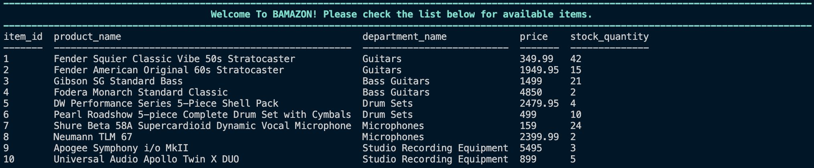
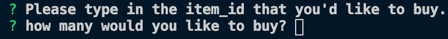
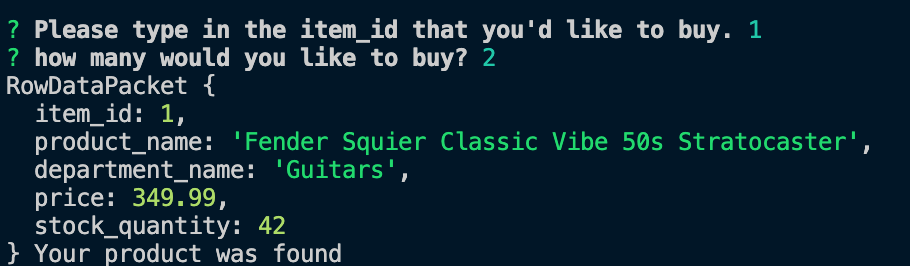
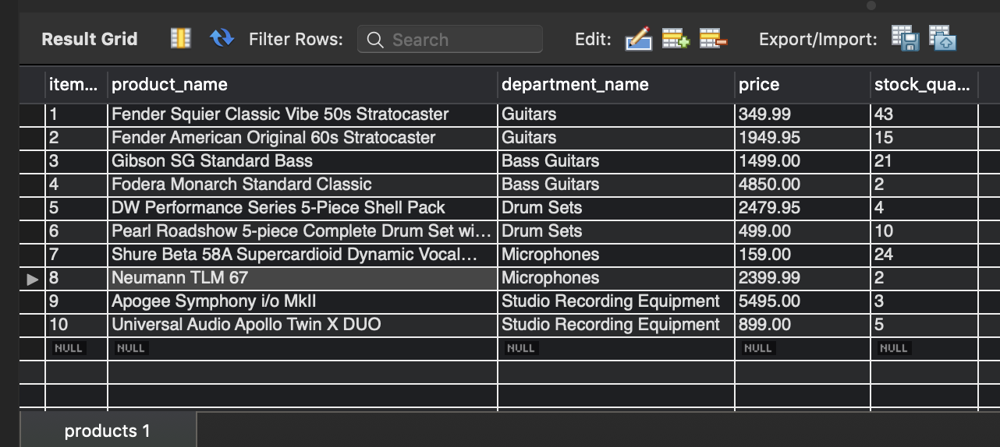
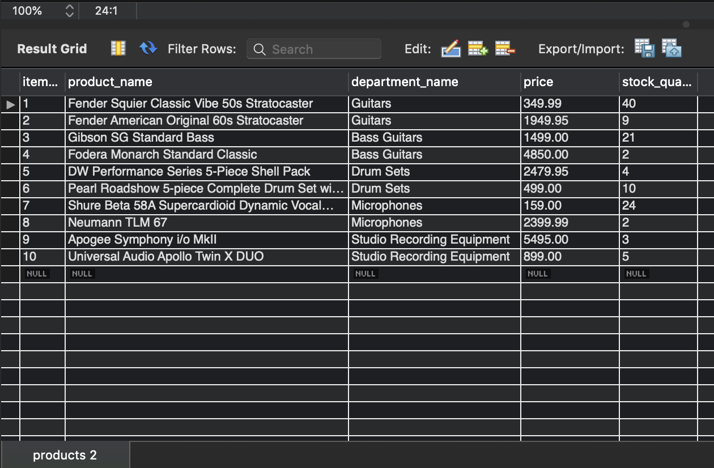
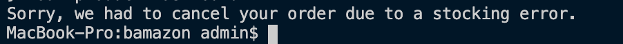

# Welcome to Bamazon

Bamazon makes use of Node.js and MySQL to simulate a sales database similar to Amazon.

## How To Use:

- After typing "npm start" into the terminal, you're shown a table similar to the one below. It contains a list of all of the available products that you can buy.
  

- You'll be asked to type in the item_id of the product you want to purchase. Type in the item_id that you want and hit Return.
  
- Then you'll be asked how many of that item you'd like. Type in the amount and hit Return.
  
- Then you'll be presented with your item:
  
- After that, the database is updated and the stock amount is adjusted.
  Database before any sales.
  
  Database after two separate orders (see top two item amounts)
  
- If you mispell something or enter a quantity greater than what's available, you'll be shown the message below:
  

## Technologies Used

- Node.js
- MySql (and Workbench)
- Javascript
- Inquirer (to prompt the user)
